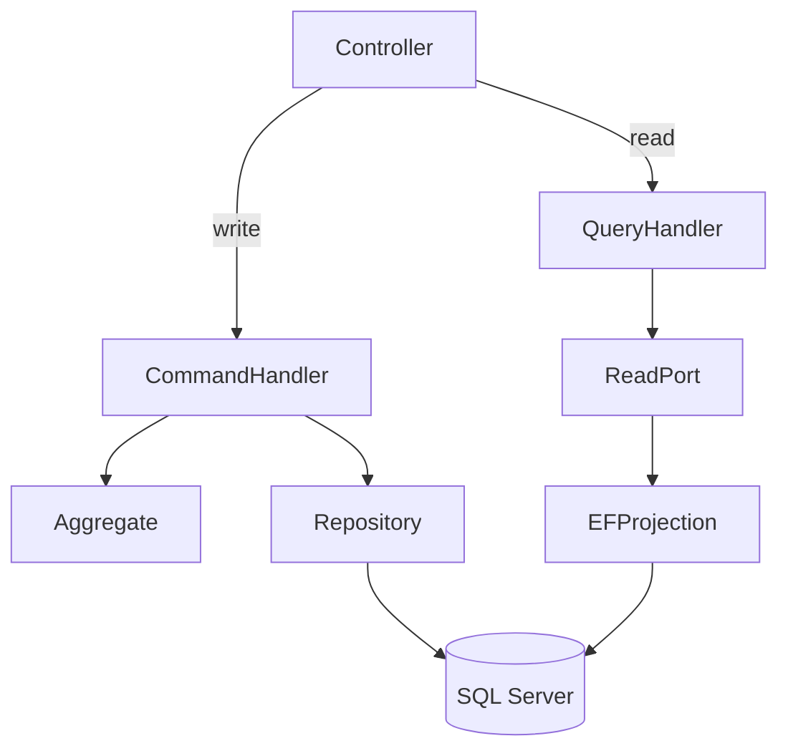

# Lightweight CQRS

## 1. Definition in CleanShop

CQRS in CleanShop means **separate code paths and models for state-changing commands and read-only queries**. It does not mean separate databases, event sourcing or distributed messaging.

## 2. Command path

Use the command path when business state changes.

Examples:

- Add basket item
- Upsert product
- Create order
- Pay order
- Ship order

The write path loads aggregate roots because their methods protect business invariants.

## 3. Query path

Use the query path when the goal is presentation/reporting and no business behavior is executed.

Examples:

- Catalog list
- Product details
- Basket display
- Customer order list
- Order details

Infrastructure projects directly to read DTOs with `AsNoTracking` where appropriate.

## 4. Why Core still defines read ports

Directly injecting `AppDbContext` into Core query handlers would violate the Core/Infrastructure dependency rule. Therefore Core defines read-service interfaces such as `ICatalogReadService`; Infrastructure implements them with EF Core.

This adds one explicit boundary without wrapping every LINQ operator behind repository methods.

## 5. What not to do

Do not:

- create one database for writes and another for reads without a scaling need;
- introduce event sourcing just because the code uses the word CQRS;
- load a full aggregate just to render a list;
- create “query repositories” with generic CRUD APIs;
- return persistence entities directly to Razor Views.

## 6. Consistency

Current reads and writes share one SQL Server database. After a successful commit, subsequent reads observe the same persisted state subject to normal database transaction/isolation semantics. There is no eventual-consistency mechanism in the baseline.

## 7. When to evolve

Separate read stores may be justified when measured requirements show that read workload, data shape, availability or reporting needs cannot be served effectively from the primary model. Such a change requires a new ADR because it introduces synchronization and operational complexity.
