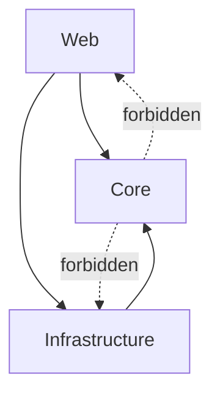

# Dependency Rules

## 1. The dependency rule

Dependencies point toward business policy.



## 2. Hard rules

### CORE-001 — Core is framework-light

`CleanShop.Core` must not reference:

- `CleanShop.Infrastructure`;
- `CleanShop.Web`;
- Entity Framework Core;
- ASP.NET Core MVC;
- ASP.NET Core Identity;
- HTTP-specific concepts;
- SQL Server-specific types.

### DOMAIN-001 — Domain owns business invariants

Rules such as “only submitted orders can be paid” or “only paid orders can be shipped” belong to aggregate methods, not controllers or repositories.

### INFRA-001 — Infrastructure implements ports

Persistence, payment, email, time and event-dispatch implementations may depend on Core interfaces. Infrastructure must not redefine business policy.

### WEB-001 — Controllers are adapters

Controllers may:

- bind/validate HTTP input;
- resolve authenticated user context;
- invoke a use-case/query handler;
- map Result/DTO to HTTP/View responses.

Controllers must not:

- use `AppDbContext` directly;
- execute business state transitions directly when a use case owns them;
- contain SQL/EF query logic;
- coordinate multi-aggregate business workflows.

### APP-001 — Use cases live under Application

New writes belong under:

```text
Core/Application/<Feature>/<UseCase>/
```

A use case handler may depend on Core ports, aggregates, value objects and other application types.

### PERSIST-001 — Repositories are aggregate-oriented

Do not create repositories for owned child entities such as `OrderItem` or `BasketItem`.

### QUERY-001 — Read models do not need aggregate reconstruction

A list/details screen may use projection through a read-service port. It should load aggregates only when domain behavior is needed.

## 3. Allowed dependency matrix

| From \ To | Domain | Application | Core Abstractions | Infrastructure | Web |
|---|---:|---:|---:|---:|---:|
| Domain | ✅ | ❌ | normally ❌ | ❌ | ❌ |
| Application | ✅ | ✅ | ✅ | ❌ | ❌ |
| Infrastructure | ✅ | ✅ | ✅ | ✅ | ❌ |
| Web | ✅* | ✅ | ✅* | ✅ composition only | ✅ |

`*` Web should prefer Application DTO/use-case APIs. Direct Domain usage is acceptable for identifiers/enums/value objects used as boundary types, but UI logic must not become domain logic.

## 4. Dependency inversion example

Core defines:

```csharp
public interface IPaymentGateway
{
    Task<Result<string>> ChargeAsync(OrderId orderId, Money amount, CancellationToken ct);
}
```

Infrastructure provides `FakePaymentGateway`.

`PayOrderHandler` depends on the interface, not on the fake implementation or a vendor SDK.

## 5. Enforcement

Architecture tests currently verify:

- Core does not depend on Infrastructure;
- Core does not depend on Web;
- Domain does not depend on EF Core;
- MVC controllers do not depend on Infrastructure persistence.

When introducing a new important rule, add an architecture test if the rule can be expressed mechanically.

## 6. Review questions

Before approving a change:

1. Did any framework type leak into Domain?
2. Did any controller begin to coordinate business behavior?
3. Was a new abstraction created without multiple meaningful implementations or a boundary need?
4. Can the new use case be found by business feature name?
5. Is a query accidentally loading a complete aggregate just to display data?
6. Did an owned child entity receive its own repository?
7. Did Infrastructure begin deciding business outcomes?
