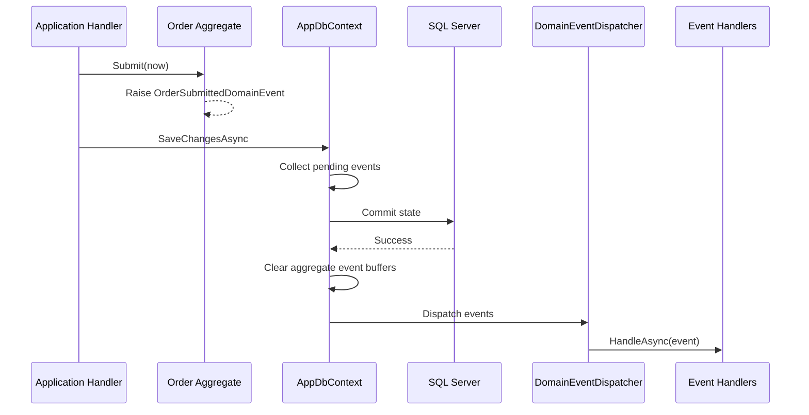

# Domain Events

## 1. Purpose

Domain events allow an aggregate to announce a business fact without depending on side-effect implementations.

Current example:

```text
Order.Submit()
    -> OrderSubmittedDomainEvent
        -> logging handler
        -> notification handler
```

`Order` knows that submission happened. It does not know how to log or send email.

## 2. Event lifecycle



## 3. Event contract

Domain events implement `IDomainEvent` and expose `OccurredOnUtc`. Event names describe something that **has happened**.

Good:

- `OrderSubmittedDomainEvent`
- `PaymentCompletedDomainEvent`

Avoid:

- `SendEmailCommand`
- `UpdateDashboardEvent`

Those names describe implementation actions rather than domain facts.

## 4. Handler placement

Interfaces are owned by Core. Infrastructure provides handlers for technical side effects such as logging/email.

A handler should be small and idempotent where practical, because future reliability improvements may introduce retries.

## 5. Reliability limitation

The current dispatcher is in-process and runs after the database save. There is no durable event log or Outbox.

Therefore:

- a database commit can succeed while an email/event handler fails;
- application process termination after commit can lose side effects;
- handlers are not suitable for business-critical cross-system guarantees.

This is an intentional baseline trade-off.

## 6. When Outbox becomes necessary

Introduce a transactional Outbox when side effects must survive crashes or integration events must be delivered reliably to external consumers.

Expected evolution:

```text
Aggregate event
   -> Save business state + Outbox row in same DB transaction
   -> background dispatcher
   -> external broker/API
   -> retry/idempotency/observability
```

This requires a new ADR because it changes transaction and operational semantics.

## 7. Domain event vs application command

A command expresses intent: “Pay order”. A domain event expresses a fact: “Order submitted”. Do not use domain events as a hidden command bus for normal synchronous business orchestration.
