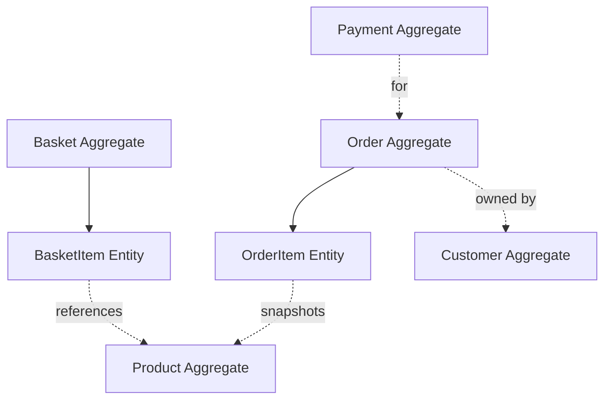
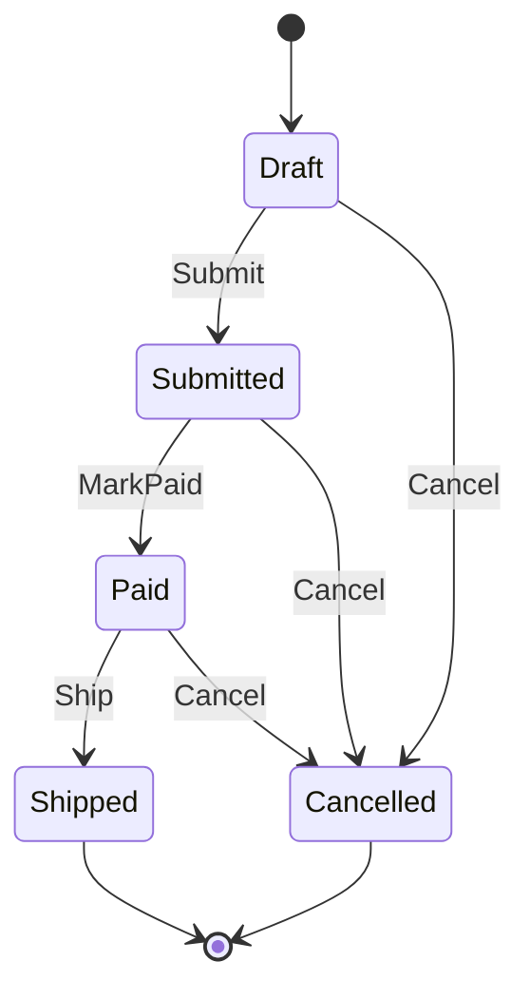

# Domain Model

## 1. Domain modeling philosophy

CleanShop uses a **rich domain model** for state-changing business behavior. Entities are not public-setter data bags. Important transitions happen through methods that protect invariants.

The current model is intentionally modest: it demonstrates DDD tactical patterns without requiring full strategic DDD machinery for every concept.

## 2. Aggregate map

Primary aggregate roots:

- `Product`
- `Customer`
- `Basket`
- `Order`
- `Payment`

Owned child entities:

- `BasketItem` belongs to `Basket`.
- `OrderItem` belongs to `Order`.

Child entities are changed through their aggregate root and do not receive standalone repositories.

## 3. Order aggregate

`Order` demonstrates most domain rules in the baseline.

Lifecycle:

Current invariants include:

- only Draft orders may be modified with `AddItem`;
- an empty Order cannot be submitted;
- only a Submitted Order can become Paid;
- only a Paid Order can become Shipped;
- Shipped and already Cancelled orders cannot be cancelled.

`Order.Total` is derived from items rather than freely assignable.

## 4. Product aggregate

Product owns catalog state and stock behavior. Checkout calls `Product.Reserve(quantity)` rather than changing stock from the application layer. This is important: inventory rules remain encapsulated in the aggregate that owns them.

## 5. Basket aggregate

Basket owns its basket lines and supports basket-specific behavior such as adding items and clearing after successful order creation.

Basket is not an Order. Its content is converted into a new Order during checkout, which allows order lines to snapshot product name/price at purchase time.

## 6. Customer aggregate vs Identity user

`Customer` is a business/domain concept. `ApplicationUser` is an authentication storage concept.

They are intentionally separate because authentication credentials and business customer identity have different reasons to change. Web's `CustomerResolver` bridges the authenticated Identity user to the business `Customer`.

## 7. Payment aggregate

Payment is persisted separately from Order. `PayOrderHandler` coordinates the external payment port, records a Payment and then marks the Order paid.

The baseline fake gateway is synchronous and simple. Real payment-provider integration introduces “unknown outcome” cases and should trigger an explicit ADR before production adoption.

## 8. Strongly typed identifiers

Examples:

- `OrderId`
- `ProductId`
- `CustomerId`
- `BasketId`

They prevent accidental mixing of unrelated `Guid` values in business code.

## 9. Value objects

### `Money`

Represents monetary amount plus currency and centralizes monetary invariants/operations.

### `Address`

Represents shipping address data as a value. `Order` normalizes it on construction.

Value objects should be immutable from the business caller's perspective and compare by value.

## 10. Domain events

`Order.Submit` raises `OrderSubmittedDomainEvent` because order submission is a business fact worth reacting to without coupling Order to email/logging concerns.

Domain events describe facts that already happened. Use past-tense names such as `OrderSubmitted`, not imperative names such as `SendOrderEmail`.

## 11. Domain exceptions vs Result

`DomainException` protects invariants inside entities. Application handlers typically return `Result` for expected use-case failures that can be communicated to users, such as empty basket, not found or conflict.

A domain method throwing indicates that a caller attempted an invalid state transition. The application layer should structure calls so expected invalid states are normally detected and translated appropriately.

## 12. Modeling checklist

When adding behavior:

- Which aggregate owns this rule?
- Can another object change the aggregate's internal state without using a method?
- Is the rule a true invariant or only input validation?
- Does a child entity need independent lifecycle? If not, keep it inside the aggregate.
- Is a new primitive type carrying domain meaning that deserves a value object or strong ID?
- Does the action produce a business fact that other components may react to?
