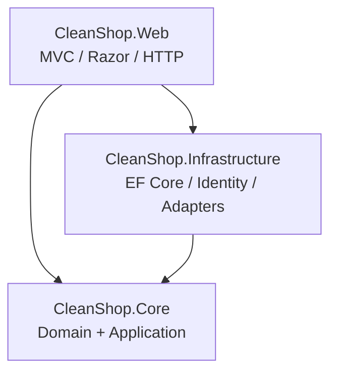
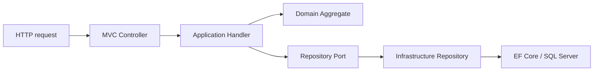
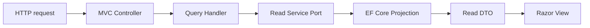

# Architecture Overview

## 1. Purpose

CleanShop is a **modularly organized monolithic ASP.NET Core MVC application** inspired by the dependency discipline of eShopOnWeb. It deliberately keeps deployment simple while separating business policy from technical details.

The architecture optimizes for:

- understandable request flows;
- domain rules that can be tested without ASP.NET Core or EF Core;
- explicit dependencies rather than framework-driven indirection;
- simple local development and deployment;
- incremental evolution when scale or complexity genuinely requires it.

It does **not** attempt to pre-build a distributed system. There is one application process, one primary relational database and one deployment unit.

## 2. Production projects

The dependency direction is the architectural core of the solution:

- `CleanShop.Core` owns business rules and application contracts.
- `CleanShop.Infrastructure` implements technical details defined by Core ports.
- `CleanShop.Web` owns presentation and composes the application.

Core never references Web or Infrastructure.

## 3. Logical layers

### Domain

Located under `CleanShop.Core/Domain` and `CleanShop.Core/SharedKernel`.

Responsibilities:

- aggregates and entities;
- value objects;
- state transitions;
- business invariants;
- domain events;
- domain-specific reusable specifications.

The Domain does not know about HTTP, controllers, Razor, EF Core, SQL Server, Identity, logging or configuration.

### Application

Located under `CleanShop.Core/Application` plus ports under `CleanShop.Core/Abstractions`.

Responsibilities:

- implement business use cases;
- orchestrate aggregates and ports;
- distinguish writes from reads;
- return explicit `Result` values for expected failures;
- define persistence/read/payment/time/email/event contracts needed by use cases.

### Infrastructure

Located under `CleanShop.Infrastructure`.

Responsibilities:

- EF Core `AppDbContext` and mappings;
- aggregate repository implementations;
- read-side projections;
- SQL Server provider;
- ASP.NET Core Identity persistence;
- fake payment adapter;
- logging email adapter;
- domain event dispatch implementation;
- system clock.

### Presentation

Located under `CleanShop.Web`.

Responsibilities:

- HTTP routing and MVC controllers;
- Razor Views and ViewModels;
- authentication/authorization attributes;
- anti-forgery validation;
- translating HTTP input to application commands;
- translating application results to HTTP responses or Views;
- composition root and middleware pipeline.

## 4. Runtime paths

### Write path

Writes load domain aggregates, invoke behavior and persist state through aggregate-specific repositories.

### Read path

Reads do not reconstruct rich aggregates unless domain behavior is required.

## 5. Architectural characteristics

| Characteristic | Baseline choice |
|---|---|
| Deployment | Monolith |
| UI | ASP.NET Core MVC + Razor |
| Business model | Rich domain model |
| Write model | Aggregate-oriented |
| Read model | Lightweight CQRS projections |
| Persistence | EF Core + SQL Server |
| Authentication | ASP.NET Core Identity |
| Mediator | None |
| Mapping library | None |
| Generic repository | None |
| Event bus | None |
| Event sourcing | None |
| Distributed transaction | None |

## 6. What “clean” means here

CleanShop treats Clean Architecture primarily as **dependency policy**, not as a requirement to create a project for every conceptual layer. Domain and Application live in the same `Core` project because they both belong inside the dependency boundary and the current system does not gain enough from an extra assembly boundary.

A new project should be introduced only when there is a concrete benefit such as independent deployment, ownership, dependency isolation, build isolation or reusable packaging.

## 7. Architectural fitness functions

The solution includes architecture tests that assert key rules:

- Core must not depend on Infrastructure.
- Core must not depend on Web.
- Domain must not depend on Entity Framework Core.
- Controllers must not depend on Infrastructure persistence types such as `AppDbContext`.

These tests are the executable part of this architecture document.
