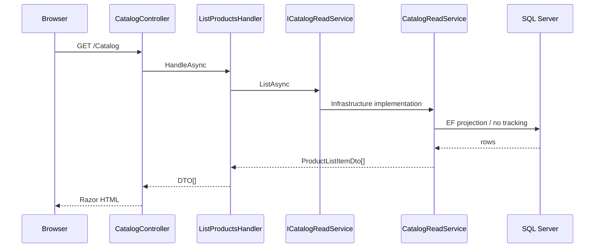
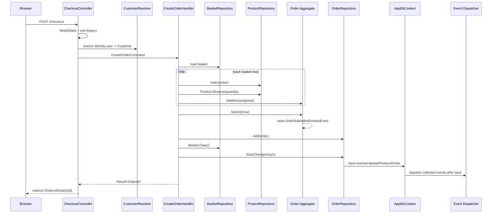
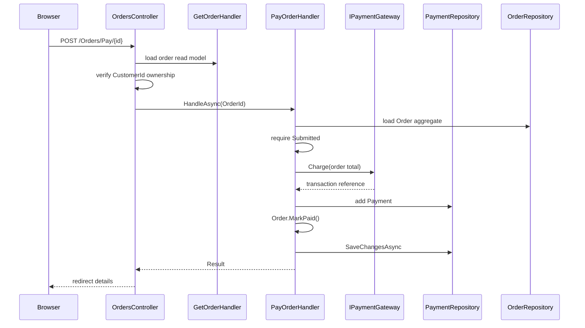

# End-to-End Request Flows

## 1. Catalog read



No Product aggregate is reconstructed because no product behavior is executed.

## 2. Add item to basket

```text
POST Basket/Add
  -> BasketController
  -> AddBasketItemHandler
  -> load Product + Basket aggregate
  -> invoke basket behavior
  -> persist
  -> redirect to Basket
```

The handler uses repositories because basket state changes.

## 3. Checkout / create order



### Transaction note

Product reservations, Basket clear and Order insert are tracked by the same scoped DbContext and committed by one save call.

## 4. Pay order



The fake gateway always represents a simple synchronous payment path. A real provider requires idempotency and unknown-outcome/reconciliation design.

## 5. Order details ownership

```text
GET /Orders/Details/{id}
  -> resolve current Customer
  -> query OrderDetailsDto
  -> if missing OR CustomerId differs: 404
  -> otherwise render View
```

The ownership check is a security boundary, not merely UI filtering.

## 6. Admin shipping

```text
POST /Admin/Orders/Ship/{id}
  -> Admin OrdersController
  -> ShipOrderHandler
  -> IOrderRepository.GetByIdAsync
  -> Order.Ship()
       requires Status == Paid
  -> SaveChangesAsync
  -> redirect to admin order details
```

The state transition rule is in `Order.Ship`, not in the Admin controller.
